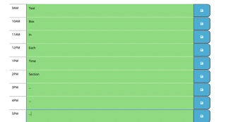
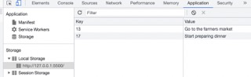

# Work-Day-Calendar
A calendar for the individual work day that displays the current day and time and has the ability to add text each individual hour of the day. The data will stay on the page during a refresh and will also be accessible in the local storage using DeveloperTools.

## Installation
Made using the latest versions of GitHub, Bootstrap, Dayjs, Visual Studio Code, and jQuery.

## Usage
When the user loads the webpage they should be presented with a 9am-5pm work day scheduler with the current date shown in the header.

If the user chooses to fill out a certain time, each individual hour can have as many events as wanted.

When the user clicks the save button after the indidivual hour, the text input will be displayed into the console memory.

*Note that the data is saved in local storage which means the data will stay even when the page has been refreshed.
## Support
For support, email me at jkrieger11@gmail.com .

## Roadmap
Application has no plans for future updates.

## Contributing
N/A

## Authors and acknowledgment
Jake Krieger 
[GitHub](https://github.com/jkrieger6?tab=repositories "GitHub Home")

## License
None

## Project status
Development for this application has stopped. If you wish to add anything to existing code, please use the email listed in support for questions, comments, or ideas.